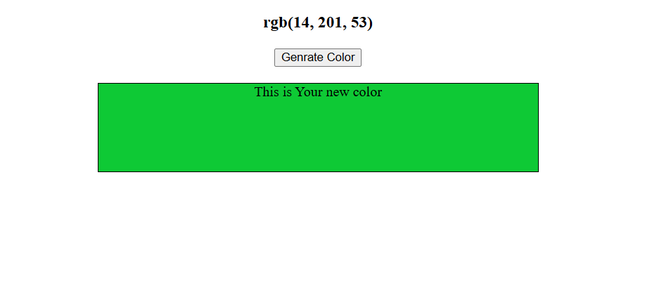

# 🎨 Random Color Generator

This is a simple web application that generates random colors with each click. It displays the generated color and shows its corresponding RGB code, making it a fun and useful tool for developers, designers, and color enthusiasts.

---

## 🚀 Features

- Generates a random color on button click.
- Displays the color code (RGB).
- Copies the color code to clipboard on click (optional).
- Responsive and minimal UI.

---

## 🛠️ Built With

- HTML
- CSS
- JavaScript

## 🔗 Links  
- **Live Demo:** https://prashasthaa.github.io/Random-color-generator/color.html
- **GitHub Repo:** https://github.com/Prashasthaa/Random-color-generator

## 🖼️ Preview

---

